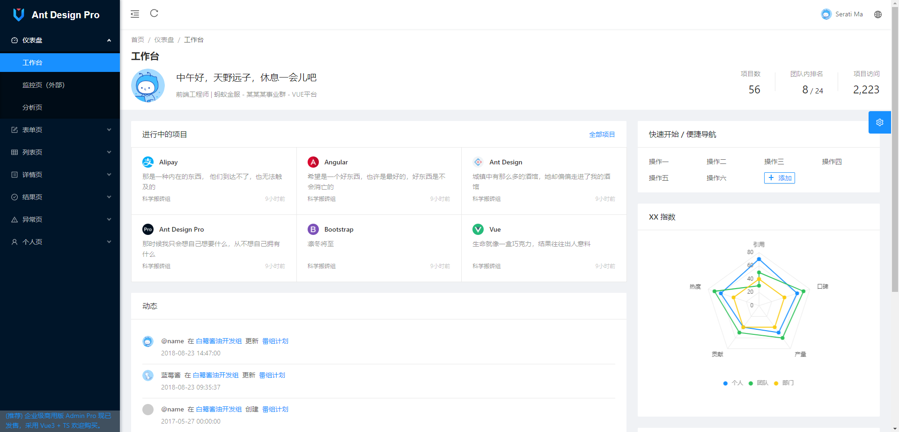

# .Net6 + Ant Design of Vue 前后端分离项目

#### 🎁项目介绍
* 前端基于ant design vue 的模板而搭建的服务器 （前端模板微小改动主要涉及后端）

* 后端涉及技术.net6、automapper、autofac、ef、jwt、Logging缓存写入文件夹、继承接口动态生成API Controle 等等技术，适用于初学者个人学习。


```
如果对您有帮助，您可以点右上角 “Star” 收藏一下 ，获取第一时间更新，谢谢！
```
#### 🍁项目说明
* 下载源码参考文档