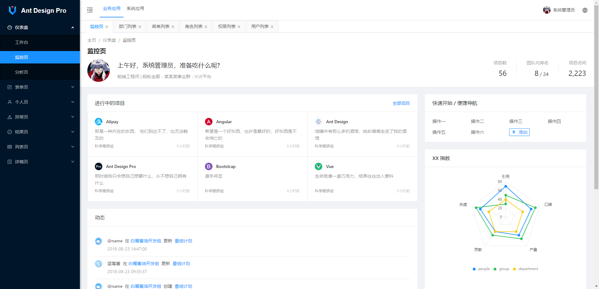

<div align="center"><h1>HuanTian</h1></div>
<div align="center"><h3>.Net6 + Ant Design of Vue 前后端分离项目</h3></div>

<div align="center">

[](https://gitee.com/wanglei6688/huantian/stargazers)

</div>

#### 🎁涉及技术

* **后端实现的功能**
1. 基于.Net6 框架开发使用 Mapster 对象映射、Autofac 自动依赖注入、Jwt 权限认证、Redis 缓存、动态生成 API Controle、Swagger 动态配置、Excel PDF 按模板导出等等
2. 基于 RabbitMQ 消息队列 实现的邮件发送和 Logging 日志生成(支持写入文件或者数据库)
3. 基于 EF Core 、SqlSugar ORM框架搭建的仓储层,支持多租户模式,数据库（暂时) SqlServer、MySql
4. 基于 Razor 模板 实现自动生成代码,减少业务代码工作量实现高效率开发
5. 基于 Hangfire.HttpJob 实现分布式定时任务调度,实现业务和调度之间解耦

* 前端基于ant design vue 的模板而搭建的服务器 （前端模板微小改动主要涉及后端）

#### 👀前端页面展示



### 🍄 快速启动

需要安装：node.js（建议版本16.18.0）、Visual Studio（建议版本2022）、Visual Studio Code

* 启动后台：打开dotnet\Huangtian.Store.sln解决方案，直接运行（F5）即可启动
* 启动前端：(建议参考文档)打开frontend文件夹，进行依赖下载，运行yarn install 再运行 yarn run serve
* 数据库: 表数据 [数据库文件](https://gitee.com/wanglei6688/huantian/blob/master/sqldata/store_db.sql) 、也可以使用EF Core 生成 
* 浏览器访问：`http://localhost:8000` （默认前端端口为：8000，后台端口为：8080）
### 体验地址
地址:      http://175.178.42.232    
账号密码:  admin 123  多租户体验: huantian 123
### 📖 帮助文档
👉前端文档：
1. [Ant Design Pro of Vue 官方文档](https://pro.antdv.com/docs/getting-started)

👉后端文档：
1. [项目文档](https://gitee.com/wanglei6688/wanglei/blob/master/dotnet/HuanTian.Store/README.md)
1. [EF Core  官方文档](https://learn.microsoft.com/zh-cn/ef/core/get-started/overview/first-app?tabs=netcore-cli)
2. [SqlSugar 官方文档](https://www.donet5.com/Home/Doc)

### 🍁项目说明
* 项目分层思想
```
Repository                        --仓储层
    HuanTian.EntityFrameworkCore  --存放EF Core相关的配置信息
    HuanTian.SqlSugar             --存放SqlSugar相关的配置信息
HuanTian.Infrastructure           --基础设施层 最上级项目主要存放实体、公共类、dll包等  方便各层级调用
HuanTian.Service                  --主要存放业务所需接口、接口实现类、Dto  命名示例 MenuService、IMenuService
HuanTian.Store                    --程序的启动项、存放一些静态文件等等   
HuanTian.WebCore                  --程序中间件的实现、服务拓展配置
```
### 🍖 补充说明

* 个人业余时间开发，白天搬砖晚上一边学习一边编码，致力于开发一个能开箱即用的脚手架项目。  
功能正在慢慢一步步完善，也非常欢迎志同道合你一起完善项目！


```
如果本项目对您有帮助，您可以点右上角 “Star” 收藏一下 ，获取第一时间更新，谢谢！
如果您发现项目有任何问题或者不合理的地方，欢迎 “Issues” 大家一起学习进步。
```